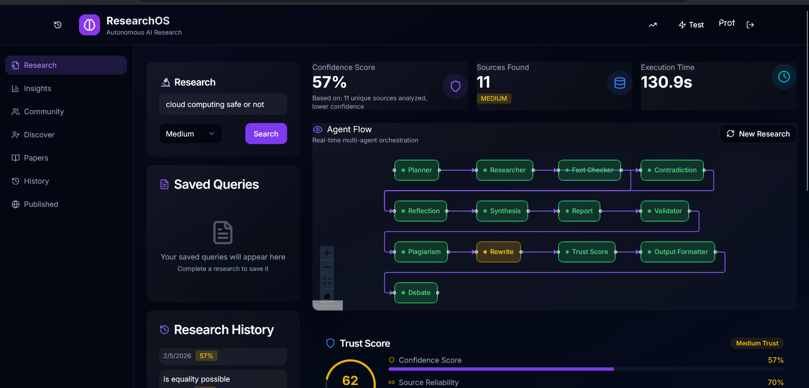
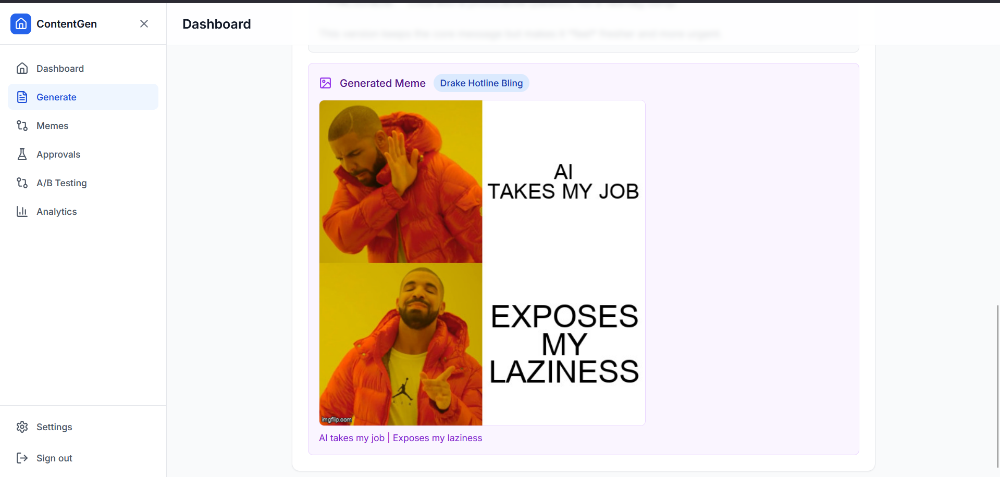
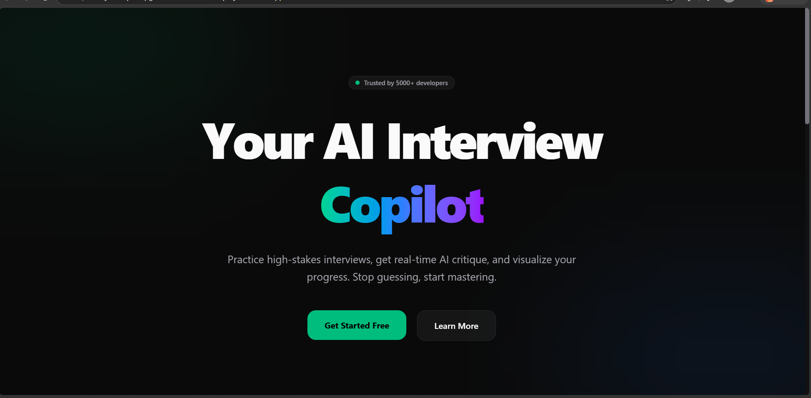
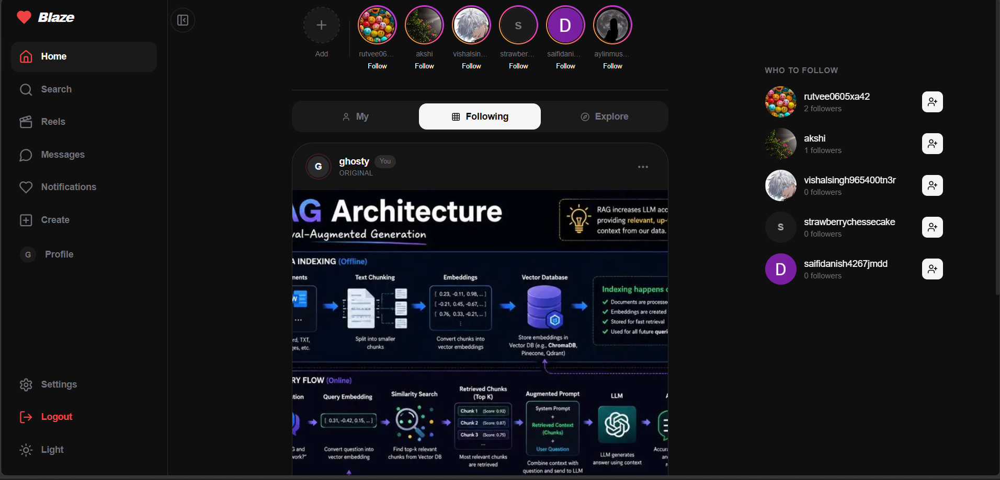

<div align="center">


<br/>

<p align="center">
<a href="https://vishal4u.vercel.app"></a>
<a href="https://linkedin.com/in/vishal-singh-188013324"></a>
<a href="https://github.com/wVishal007"></a>
<a href="mailto:vishalsingh31879@gmail.com"></a>
</p>


</div>


## ⚡ System Boot

```yaml
$ whoami --verbose

name       : Vishal Singh
role       : Agentic AI Engineer & Systems Architect
status     : ● ONLINE — open to collabs
location   : India
focus:
  - Multi-agent systems & autonomous pipelines
  - RAG architectures & hybrid vector retrieval
  - Full-stack systems engineering
  - LangChain / LangGraph orchestration
philosophy : "Today is victory over yourself of yesterday." — Miyamoto Musashi
```

<div align="center">

┌──────────────────────────────────────────────────────────┐

**"Today is victory over yourself of yesterday."**
*— Miyamoto Musashi, The Book of Five Rings*

└──────────────────────────────────────────────────────────┘

</div>

<div align="center">

<table>
<tr>
<td align="center">🟢<br/><b>ONLINE</b><br/><sub>open to collabs</sub></td>
<td align="center">🎯<br/><b>Multi-Agent AI</b><br/><sub>RAG · Full-Stack</sub></td>
<td align="center">🏆<br/><b>3× Wins</b><br/><sub>hackathons</sub></td>
<td align="center">📜<br/><b>10+</b><br/><sub>certifications</sub></td>
<td align="center">🧑‍🏫<br/><b>20+</b><br/><sub>devs mentored</sub></td>
</tr>
</table>

</div>

<p align="center">
I build production-grade AI systems — multi-agent pipelines, hybrid RAG engines, and autonomous workflows — alongside full-stack platforms with real-time infrastructure. I work at the intersection of AI/ML and backend engineering: a 13-agent research pipeline governed by a custom guardrail layer, a citation-enforced retrieval engine, a LangGraph content agent with multi-provider LLM fallback. I care about systems that scale cleanly and hold up under real interview-level scrutiny.
</p>


## 🏆 Battle Log

<div align="center">

| 🥇 Winner | 🥉 3rd Place | 🎯 Sponsor Track |
|:---:|:---:|:---:|
|  |  |  |
| **IIT Delhi Hackathon (TechGyan)** | **Infronix Hackathon, IIIT Delhi** | **Hackemon Hackathon** |
| Led team to 1st place under time constraints | Built JanSaathi — AI govt-scheme recommender | Recognized for innovation & execution, Team Dcoders |

</div>


## 🛠️ Tech Arsenal

<div align="center" width="100%">

| Category | Stack |
|:---|:---|
| **Languages** |      |
| **Frontend** |      |
| **Backend & Databases** |       |
| **Machine Learning / Deep Learning** |     |
| **AI / LLM Ecosystem** |       |
| **DevOps & Tools** |     |

</div>


## 🚀 Featured Builds

<table>
<tr>
<td width="50%" valign="top">

<div align="center">
<b>🔬 RESEARCHOS</b><br/>
<sub>Autonomous AI Research Platform</sub>
</div>

<p align="center"></p>

13-agent pipeline enforced by a custom PipelineGuard — Planner → Researcher → FactChecker → Synthesis → Report → Validator → Debate.
- RAG on ChromaDB with cosine similarity + multi-hop retrieval
- Real-time SSE streaming → React Flow visualization
- Plagiarism detection, auto-correction, CSV-to-ML code gen

`Next.js` `LangChain` `Mistral AI` `ChromaDB` `MongoDB`

[🔗 Live Demo](https://research-os-three.vercel.app/)

</td>
<td width="50%" valign="top">

<div align="center">
<b>⚡ CONTENT GENERATOR PLATFORM</b><br/>
<sub>Agentic AI Content System</sub>
</div>

<p align="center"></p>

LangGraph StateGraph workflow: generates → scores 0–10 → iteratively optimizes with a 4-provider LLM fallback chain (Groq → Mistral → Gemini → NVIDIA).
- Human-in-the-loop approval queue + A/B testing engine
- Multi-platform generation (LinkedIn, X, Instagram) with 20+ language translation
- FastAPI + PostgreSQL + Redis, Dockerized

`LangGraph` `FastAPI` `PostgreSQL` `Redis` `Docker`

[🔗 Live Demo](https://content-generator-agent-pi.vercel.app/) · [💻 Source](https://github.com/wVishal007/content_generator_agent)

</td>
</tr>
<tr>
<td width="50%" valign="top">

<div align="center">
<b>🧠 YT INTELLIGENCE ENGINE</b><br/>
<sub>Hybrid RAG with Citation</sub>
</div>

<p align="center"></p>

Conversational AI over YouTube transcripts with hybrid dense + keyword retrieval.
- Semantic search + BM25 + cross-encoder reranking
- Multi-turn memory, context-aware question rewriting
- Timestamped citations, grounded hallucination control

`LangChain` `ChromaDB` `Mistral AI` `Chrome Extension`

[💻 Source](https://github.com/wVishal007/yt-rag-chatbot-extension)

</td>
<td width="50%" valign="top">

<div align="center">
<b>💼 AI INTERVIEW COPILOT</b><br/>
<sub>Dual-LLM Interview Platform</sub>
</div>

<p align="center"></p>

Dynamic question generation across technical, behavioral, and system-design domains.
- Real-time evaluation with confidence scoring
- Dual-role architecture (student/recruiter) with RBAC
- 12 MongoDB models, bcrypt + OTP auth, Zod validation

`Next.js 16` `MongoDB` `OpenAI` `Gemini`

[🔗 Live Demo](https://ai-job-copilot-one.vercel.app)

</td>
</tr>
<tr>
<td width="50%" valign="top">

<div align="center">
<b>🛍️ ETHEREAL COMMERCE</b><br/>
<sub>Luxury E-Commerce Platform</sub>
</div>

<p align="center"></p>

Curated boutique storefront with a personalization engine and full admin suite.
- Style Quiz onboarding with tag-based dynamic curation
- Razorpay payments with real-time verification
- Lookbook management, dynamic size guides (cm/in)

`Next.js 15` `React 19` `MongoDB` `Razorpay`

[🔗 Live Demo](https://ethix-nine.vercel.app/)

</td>
<td width="50%" valign="top">

<div align="center">
<b>🌐 BLAZE</b><br/>
<sub>Social Media Platform</sub>
</div>

<p align="center"></p>

Full-scale social platform: posts, stories, reels, real-time chat — 15+ schema data model.
- Real-time chat/notifications via WebSockets (Ably)
- Stories with 24hr expiry, personalized feed
- NextAuth with Google OAuth, explore feed

`Next.js` `TypeScript` `MongoDB` `Ably`

[🔗 Live Demo](https://blaze-social-zeta.vercel.app/)

</td>
</tr>
</table>

<details>
<summary><b>📈 More Projects — Expand</b></summary>
<br/>

**Freelancer Income Prediction** — *Deep Learning Regression*
Three-layer neural network (128 → 64 → 1) in PyTorch, trained with Adam over 350 epochs. 433-dimensional feature space via one-hot encoding + StandardScaler, with dynamic feature reindexing for consistent inference. Deployed as a Flask API with real-time predictions through a React frontend.
`PyTorch` `Flask` `Pandas` `Scikit-learn` `React`
[🔗 Live Demo](https://incomeprediction-hwtw.onrender.com) · [💻 Source](https://github.com/wVishal007/IncomePrediction-NeuralNetwork-Pytorch)

<br/>

**Anime Recommendation System** — *NLP Engine*
<p align="center"></p>
Content-based recommendation engine using CountVectorizer and cosine similarity across 1000+ records. Pre-computed similarity matrices with NumPy vectorized operations. Deployed on Vercel with a Flask backend.
`Python` `Flask` `Scikit-learn` `NumPy`
[🔗 Live Demo](https://anime-recommendations-lime.vercel.app/)

<br/>

**Sentiment Analysis on IMDB** — *NLP Classification*
Binary sentiment classification on 50,000 movie reviews with TF-IDF vectorization, Logistic Regression, Naive Bayes, and an NLTK preprocessing pipeline.
`Python` `Scikit-learn` `TF-IDF` `NLTK`

<br/>

**Real-Time Chat Application** — *Full Stack*
Private and group messaging with read receipts, online status tracking, and message encryption; backend architecture handling multiple concurrent connections with optimized queries.
`React` `Node.js` `Socket.io` `MongoDB`
[💻 Source](https://github.com/wVishal007)

</details>


## 📜 Certifications

<div align="center">

**IBM**

|  |  |  |  |
|:---:|:---:|:---:|:---:|
|  |  |  |  |
| **Make Agentic AI Work** | **RAG for Enhanced AI Outputs** | **AI Fundamentals** | **Web Dev Fundamentals** |

<br/>

**Simplilearn**

|  |  |  |  |  |
|:---:|:---:|:---:|:---:|:---:|
|  |  |  |  |  |
| **Deep Learning** | **DSA in Python** | **Intro to MERN Stack** | **Python Programming** | **TypeScript Basics** |

<br/>

**AI / ML Specializations**

|  |  |  |
|:---:|:---:|:---:|
|  |  |  |
| **ML & Neural Networks** | **Artificial Intelligence** | **PyTorch** |

</div>


## 📊 System Analytics

<div align="center">


<br/><br/>


<br/><br/>


<br/><br/>


<br/><br/>


<br/><br/>


<br/><br/>


</div>


<div align="center">

### 🤝 Let's Build Something Extraordinary

<p align="center">
<a href="https://vishal4u.vercel.app"></a>
<a href="https://linkedin.com/in/vishal-singh-188013324"></a>
<a href="https://github.com/wVishal007"></a>
<a href="mailto:vishalsingh31879@gmail.com"></a>
</p>


</div>